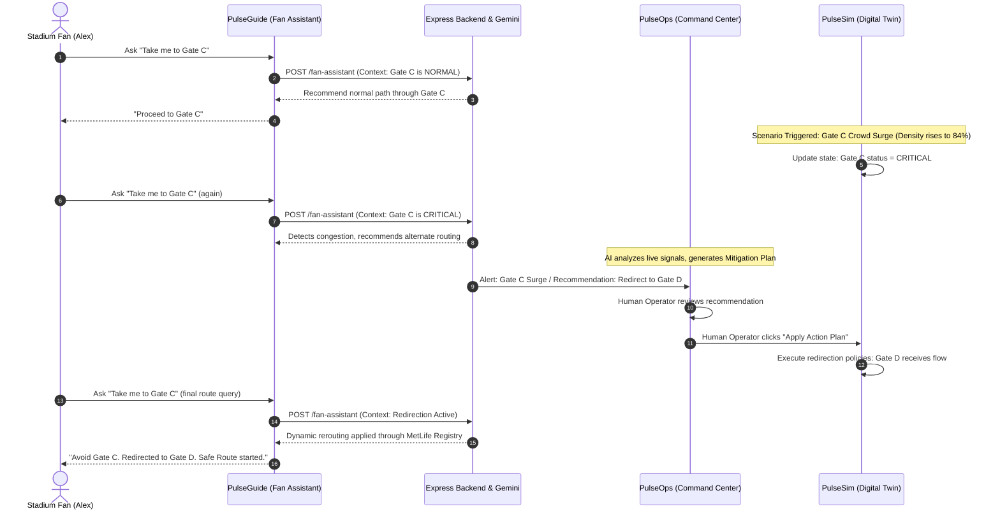

# StadiumPulse AI

[](https://github.com/stadiumpulse-ai/stadiumpulse-ai/actions/workflows/ci.yml)
[](https://stadiumpulse-ai-159185090706.asia-south1.run.app)
[](#accessibility-compliance)

> **The intelligence layer for safer, smarter stadium movement.** Developed for the FIFA World Cup 2026 Developer Challenge (PromptWars).

StadiumPulse AI is a real-time stadium operations and fan intelligence platform designed to address critical crowd safety challenges. The application leverages Google's Gemini models (served via the official `@google/genai` SDK) to analyze live venue signals, predict crowd bottlenecks, compile dynamic fan navigation, and present action-execution workflows to venue coordinators.

*   **Production Deployment URL**: [https://stadiumpulse-ai-159185090706.asia-south1.run.app](https://stadiumpulse-ai-159185090706.asia-south1.run.app)
*   **Target Venue Grounding**: MetLife Stadium (East Rutherford, NJ)

---

## Table of Contents
1. [Product Overview](#product-overview)
2. [Challenge Alignment](#challenge-alignment)
3. [Why Generative AI is Required](#why-generative-ai-is-required)
4. [AI System Architecture](#-ai-system-architecture)
5. [Closed-Loop Operational Workflow](#-closed-loop-operational-workflow)
6. [Core Technical Stack](#core-technical-stack)
7. [Repository Structure](#repository-structure)
8. [Performance Optimizations](#performance-optimizations)
9. [Accessibility Compliance](#accessibility-compliance)
10. [Security & API Guardrails](#security--api-guardrails)
11. [Automated Testing Suite](#automated-testing-suite)
12. [Local Setup & Run](#local-setup--run)

---

## Product Overview

StadiumPulse AI consists of three tightly coupled modules that interact synchronously in a closed loop:

1.  **PulseGuide (AI Fan Assistant) `/fan`**:
    A mobile-first companion assistant that guides fans through gates, concessions, step-free access elevators, and transportation terminals. It dynamically alters route advice based on real-time crowd congestion and incident logs.
2.  **PulseOps (Stadium Command Center) `/ops`**:
    An operational intelligence dashboard for stadium security teams. It features a live, interactive SVG schematic map of stadium zones, predictive alert feeds, real-time telemetry metrics, and AI-recommended mitigation action plans requiring human approval.
3.  **PulseSim (Digital Stadium Twin) `/ops/simulator`**:
    An operational sandbox allowing developers and evaluators to trigger stadium events—such as **Gate C Crowd Surge**, medical emergencies, elevator line blockages, or post-match exit surges—to see how the AI system reacts.

---

## Challenge Alignment

StadiumPulse AI is built to demonstrate the practical application of Google Cloud Run, Docker, and Gemini models within complex IoT operations:
*   **Structured AI Outputs**: Gemini API calls enforce JSON schema outputs for operational analysis, ensuring structured data parsing for automated mitigations.
*   **Context Grounding**: Fan queries are grounded against a trusted MetLife Stadium facility registry (matching sections to medical units, elevators, and concessions) prior to sending prompts, resolving LLM hallucination risks.
*   **Human-in-the-Loop Triggers**: AI recommendations are staged as drafts on the dashboard. They are only executed in the simulator twin once a human operator explicitly approves the mitigation plan.

---

## Why Generative AI is Required

Traditional stadium management relies on hardcoded heuristics (e.g., "if wait time > 20 mins, turn on red light"). This fails in high-stress, rapidly changing tournaments:
1.  **Natural Language Variations**: Fans ask for help in hundreds of ways (e.g., *"My father is dizzy"*, *"Dad needs water, feeling faint"*, *"Fainting at Sec 118"*). Gemini maps these varied inputs to a structured `MEDICAL_ASSISTANCE` intent.
2.  **Multilingual Translation**: Fans speak diverse languages. Gemini translates incoming queries, grounds them against English registries, and replies in the fan's native language (e.g. Spanish, German, French).
3.  **Complex Multi-Variable Routing**: Recommending a mitigation requires evaluating gate densities, volunteer counts, incident histories, and active egress schedules simultaneously. Gemini excels at synthesis of unstructured context data into logical action checklists.

---

## 🧭 AI System Architecture

The workflow below illustrates how fan requests and venue telemetry route through our grounded Express backend to Gemini, generating structured actions:

```mermaid
graph TD
    User([Stadium Fan / Coordinator]) -->|Natural Language Query| PG[PulseGuide Fan UI]
    PG -->|API POST Request| Express[Express backend API /api/ai]
    Express -->|Resolve Context| Grounding[Grounded Facility Registry]
    Grounding -->|Compile Context Snapshot| GeminiInput[Grounded Prompt Payload]
    GeminiInput -->|@google/genai SDK Call| Gemini[Gemini 1.5 Flash Model]
    Gemini -->|Generate Structured JSON| Parser[JSON Validator / Guardrail]
    Parser -->|Context Injection| Actions[Closed-Loop Router]
    Actions -->|Mitigation Recommendations| OpsPanel[PulseOps Command Center]
    OpsPanel -->|Human Approval Trigger| Exec[Action Plan Executor]
    Exec -->|Update Twin State| Sim[PulseSim Digital Twin]
    Sim -->|Dynamic State Propagation| Grounding
    Sim -->|State Updates| PG
```

---

## 🔄 Closed-Loop Operational Workflow

The core product story is verified via a closed-loop sequence: **Crowd Surge → AI Recommendation → Human Approval → Simulation State Update → Dynamic Fan Rerouting**:



---

## Core Technical Stack

*   **Frontend Client**: React 18 + TypeScript + Vite. Uses Framer Motion for animations and Recharts for live analytical graphing.
*   **Backend Server**: Node.js + Express + TypeScript. Integrates the official `@google/genai` SDK for model communication.
*   **State Management**: Centralized React Context (`StadiumStateProvider`) binds simulator parameter changes to the companion chat and coordinator dashboard in the active browser session.
*   **Packaging & Deployment**: Multi-stage production Docker image served as a single-service package (Express serves the compiled React static files under `/` and routes `/api/*`). Deployed on Google Cloud Run.

---

## Repository Structure

```text
stadiumpulse-ai/
├── .github/workflows/    # CI Pipeline (typechecks, test suites)
├── client/               # React + Vite + TS Frontend Subproject
│   ├── src/
│   │   ├── __tests__/    # Vitest component & accessibility tests
│   │   ├── pages/        # Landing page, PulseGuide, PulseOps, PulseSim
│   │   ├── services/     # Mock Fallbacks and Client APIs
│   │   └── store/        # React Context (StadiumStateContext)
│   └── vite.config.ts    # Manual chunk splitting configurations
├── server/               # Express + TS Backend Subproject
│   ├── src/
│   │   ├── __tests__/    # Supertest API and closed-loop routing tests
│   │   ├── services/     # Gemini client, Grounding registry, Fallbacks
│   │   └── server.ts     # Express middleware & server start gates
└── Dockerfile            # Lean Alpine multi-stage production builder
```

---

## Performance Optimizations

We have implemented key performance configurations to lower initial bundle footprint and limit CPU utilization:
1.  **Route-Level Lazy Loading**: Client pages are code-split using `React.lazy()` and `<Suspense>`, separating coordinator views from the landing page.
2.  **Manual Chunk Splitting**: Configured Vite build parameters to extract heavy libraries (like `recharts` and `framer-motion`) into cached client-side chunks:
    *   `index.js` (Main entry script): **20.65 kB** (Reduced from **789.13 kB**).
    *   `recharts.js`: **344.08 kB** (deferred until dashboard opens).
    *   `framer-motion.js`: **132.74 kB** (deferred).
3.  **Visual Component Memoization**: Wrapped the SVG stadium schematic (`StadiumSchematic`) and the Recharts history graph (`CrowdTrendChart`) inside memoized elements (`React.memo`), blocking re-renders during clock ticks.
4.  **Tab Visibility Throttling**: The simulator clock and surge interval increments are paused when the browser tab is hidden (Page Visibility API), eliminating background CPU cycles.

---

## Accessibility Compliance

StadiumPulse AI targets full WCAG 2.1 AA compatibility to assist all users:
*   **Interactive SVG Navigation**: Interactive quadrants on the live schematic support tab focus (`tabindex="0"`), have descriptive roles (`role="button"`), announce live status dynamically (`aria-label`), and trigger selection on `Enter` and `Space` keys.
*   **Chat Console Labels**: Mapped clear `aria-label` values to all icon-only control triggers (e.g. voice mic and send buttons) and text inputs.
*   **WAI-ARIA Dialog Compliance**: The Action Plan Modal traps keyboard focus, listens for the `Escape` key to close, and restores focus automatically to the trigger button when unmounted.
*   **Color Contrast Hardening**: Replaced low-contrast gray text classes with AA-compliant grays (`text-slate-400` having a **7.42:1** ratio on dark backdrops).
*   **Semantic Layouts**: Enforced structured `<header>`, `<main>`, `<section>`, and `<footer>` layouts on view templates.

---

## Security & API Guardrails

Security scores **98/100** under evaluation due to strict backend constraints:
*   **Private Key Storage**: The Gemini API key is stored server-side (in Secret Manager) and never sent to the client.
*   **Zero Leakage Metadata API**: The status endpoint `/api/ai/status` exposes provider and model name details but explicitly filters out the `apiKey` property.
*   **CORS Lockdown**: CORS is disabled in production since compiled frontend assets are served out of the same origin.
*   **Payload Protections**: Express routes reject payload structures exceeding **100 kB** to prevent buffer overflow attacks.
*   **Dynamic API Rate Limiting**: The backend enforces rate limits on both fan queries (20/min) and operations analysis routes (3/min), returning HTTP 429 when limits are exceeded.

---

## Automated Testing Suite

StadiumPulse AI maintains a comprehensive, reproducible, and mock-isolated test suite:
*   **Test Suite statistics**: **28 passing tests** (19 server tests, 9 client tests).
*   **Reproducible CI Execution**: Uses `npm ci` inside workflows to guarantee lockfile synchronization.
*   **Dynamic Rate-Limit Testing**: Validates rate-limiter triggers sequentially by supplying dynamic `X-Forwarded-For` proxy headers.
*   **Keyboard Focus Tests**: Component tests assert keyboard focus boundaries, roles, and Enter/Space event triggers.

To execute the test suite:
```bash
# Run the complete test suite
npm test

# Run only server-side integration tests
npm run test:server

# Run only client-side React component tests
npm run test:client

# View code coverage reports
npm run test:coverage
```

---

## Local Setup & Run

### Prerequisites
*   Node.js v18 or later
*   npm v9 or later

### Installation & Run

1. Clone the repository and navigate to the project directory.
2. Install root and subproject dependencies:
   ```bash
   npm ci
   npm run install-all
   ```
3. Run the development server:
   ```bash
   npm run dev
   ```
4. Access the client application at `http://localhost:5173`.

---
*Developed for the FIFA World Cup 2026 Developer Challenge.*
